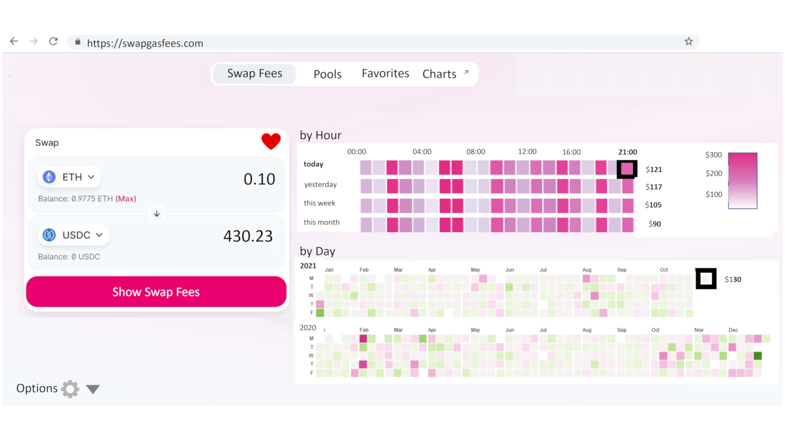
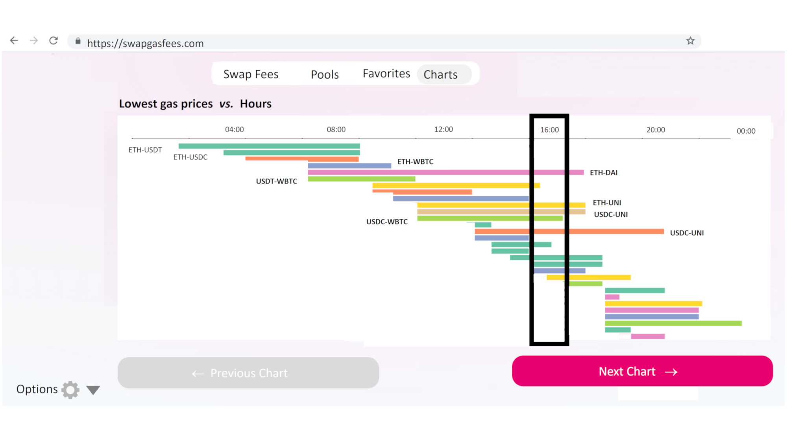

# SwapGasFees: Design of an Analytics Dashboard for Gas Fees on Uniswap 

<hline>
</hline>

**[Gurdal Ertek](https://ertekprojects.com)**

_Member of [BlockBlockData](https://blockblockdata.com) Team; Associate Professor of Business Analytics, UAE University, Abu Dhabi, UAE_

<hline>
</hline>

## Abstract
  
This project proposes design of **an analytics dashboard to** interactively and dynamically **display swap gas fees** (swap fees) on [Uniswap](https://uniswap.org). The dashboard also displays other charts that give analytical insights into the Uniswap ecosystem. 

The proposed SwapGasFees app is not implemented during the period of [UniCode Competition 2021](https://unicode.ethglobal.com/), due to lack of time and difficulties in finding team members. Yet, it outlines a blue print of how such a system can be implemented over an extended time period. In other words, the design provides a template, through which such a dashboard can be coded.

## Uniswap and Swap Fees

[Uniswap](https://uniswap.org) is the by far most popular decentralized exchange in the world, enabling swaps (exchanges) of many different tokens and coins on the Ethereum layer 1 blockchain network.

One of the fundamental issues in swaps is the "swap gas fee", which is in a way the fee paid to the blockchain network for evaluating and recording a swap transaction. The swap gas fees, or in short, swap fees, can change significantly over time, depending on the congestion of the Ethereum network, level of liquidity, trade volume, and many other factors. 

## Design Principles

## Data Extraction

The following libraries can be used for data extraction from Uniswap:

- The most **important** link is the [Uniswap v3 contract maps](https://j1mmy.fi), which document the Pool Contract, Factory Contract, and Position Manager.
- [BitQuery](https://graphql.bitquery.io/ide) (to query data from blockchains)
- [Flipside Crypto](https://app.flipsidecrypto.com) (to query data from blockchains)
- [GraphQL](https://medium.com/coinmonks/get-uniswap-data-using-the-graph-79d0c6f7b9f2) (to extract data from Uniswap)

## UI Design 

This section describes the basic design of the user interface (UI) for the proposed SwapGasFees app. The detailed design and the details of how the app will work will be added as a separate tutorial later. The full UI design can be downloaded as a pdf file from [here](./figures/SwapGasFees_Design.pdf).

There are two main screens/interfaces in the app:

- **Interface 1:** Analytics for gas fees for a selected swap pair  (under the `Swap`, `Pools`, and `Favorites` tabs) 
- **Interface 2:** Analytics for gas fees and Uniswap pools, in general (under the `Charts` tab)

Now let us look into both of these interfaces, and explain each.

## **Interface 1:** Swap Gas Fees

<ul>
  <li>...</li>
  <li>...</li>
  <li>...</li>
</ul> 

## **Interface 2:** Uniswap Analytics

<ul>
  <li>...</li>
  <li>...</li>
  <li>...</li>
</ul> 

## Visualizations

The main library to be used for visualizations is selected as [D3.js](https://d3js.org):
- D3 Visualization Gallery (JavaScript library for manipulating documents based on data)
https://observablehq.com/@d3/gallery

<ul>
  <li>Visualizations for the <b>first three tabs</b></li>
      <ul>
        <li><a href="https://observablehq.com/@mbostock/the-impact-of-vaccines" target="_blank">Timeline</a> (for slides 2-6)</li>
        <li><a href="https://observablehq.com/@d3/calendars" target="_blank">Calendar</a> (for slides 2-6)</li>
      </ul> 
  <li>Visualizations for the <b>Charts tab</b></li>
      <ul>
        <li><a href="https://observablehq.com/@tezzutezzu/world-history-timeline" target="_blank">Timeline</a> (for slide 7) (to see which are the cheapest hours or the day/week for each swap pair, where pairs are the rows, color is the gas fee)</li>
        <li><a href="https://observablehq.com/@d3/bubble-chart" target="_blank">Bubble chart</a> (for slide 8) (showing volumes of all pairs, or coins in pools, size is volume, color can be volume/liquidity, red color tones if above median)</li>
        <li><a href="https://observablehq.com/@d3/arc-diagram" target="_blank">Arc diagram</a> (for slide 9) (to see the pairs in the pools, color shows the main coin, such as ETH, USDT, USDC, DAI)</li>
        <li><a href="https://observablehq.com/@mbostock/the-wealth-health-of-nations" target="_blank">Animated scatter plot</a> (for slide 10) (to see changes in multiple dimensions, as an animation)</li>
        <li><a href="https://observablehq.com/@d3/chord-diagram" target="_blank">Chord diagram</a> (for slide 11) (to see volume & liquidity changes in pools, and in coins)</li>
      </ul> 
  <li><b>Other</b> possible visualizations under <b>Charts</b></li>
      <ul>
        <li><a href="https://observablehq.com/@d3/realtime-horizon-chart" target="_blank">Realtime Horizon Chart</a> (scrolling data, where time is x axis, pair is y axis, and color is the gas fee)</li>
        <li><a href="https://observablehq.com/@d3/treemap" target="_blank">Treemap</a> (showing volumes of all pairs)</li>
        <li><a href="https://observablehq.com/@d3/streamgraph" target="_blank">Stacked Area Chart</a> (to see changes in volume and liquidity, color is pair)</li>
        <li><a href="https://observablehq.com/@d3/sankey" target="_blank">Sankey Diagram</a> (changes in volume of pairs, color shows pair)</li>
  </ul> 
</ul> 

## Suggested Technology Stack

- For the **backend**, the above data extraction tools can be tested, and the one that provides the fastest and most reliable results can be selected.
- For the **frontend**, the easiest thing to do would be to fork the Uniswap front-end code and do modifications on that. 
- For **visualizations**, as mentioned earlier, the most suitable library is thought to be [D3.js](https://d3js.org/). The [D3 Visualization Gallery](https://observablehq.com/@d3/gallery) at [Observable HQ](https://observablehq.com/@d3/) provides source codes for all the essential charts, that can be used in the SwapGasFees app.

## Author

<table>
  <tr>
    <td width=150px></td>
    <td><b>Gürdal Ertek</b> is an Associate Professor at UAE University (UAEU), Al Ain, UAE. He received his Ph.D. from Georgia Institute of Technology, Atlanta, GA, in 2001. Dr. Ertek served in educational and research organizations in Turkey, USA, Singapore, Kuwait and UAE, as well as an on-site reviewer for 50+ industrial R&D projects. His research and teaching areas include applied data science, business analytics, supply chain management, project management, and R&D management. His earlier hackathon in the Ethereum ecosystem was the <a href="**http://ertekprojects.com**" target="_blank">"Medalla Data Challenge,"</a> where Dr. Ertek was the only participant from academia, and <a href="https://blockblockdata.github.io/medalla-data-challenge/" target="_blank">joint work with teammate Joseph Kholodenko</a>, as <a href="https://blockblockdata.com" target="_blank">BlockBlockData Team</a>, was awarded with <a href="https://blog.ethereum.org/2020/11/17/medalla-data-challenge-results/" target="_blank">Bronze Medal</a>. Dr. Ertek's research and other work can be accessed through <a href="http://ertekprojects.com" target="_blank">ErtekProjects.com</a>  </td>
  </tr>
</table>

