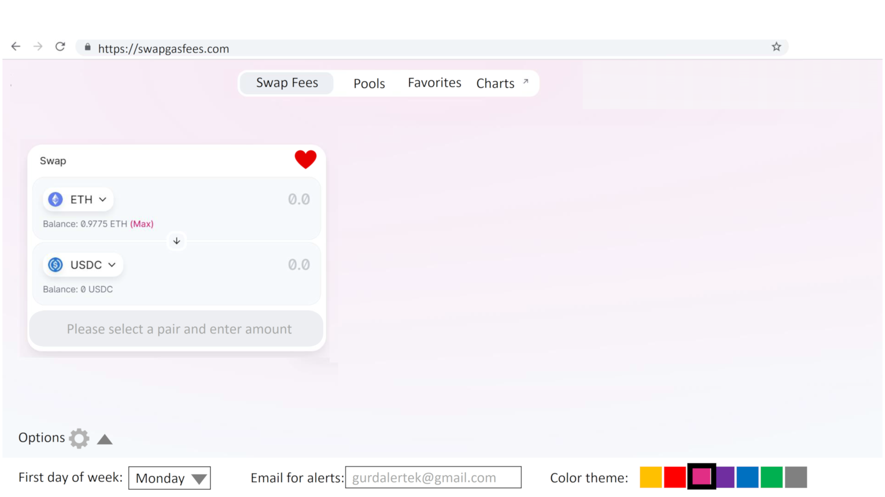
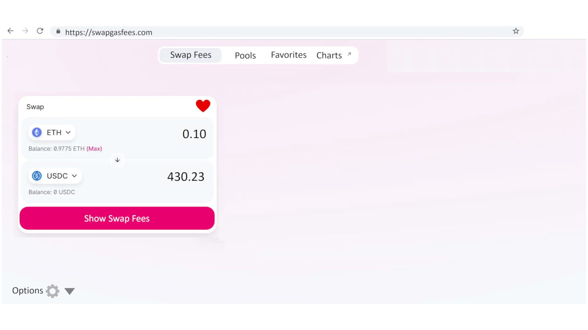
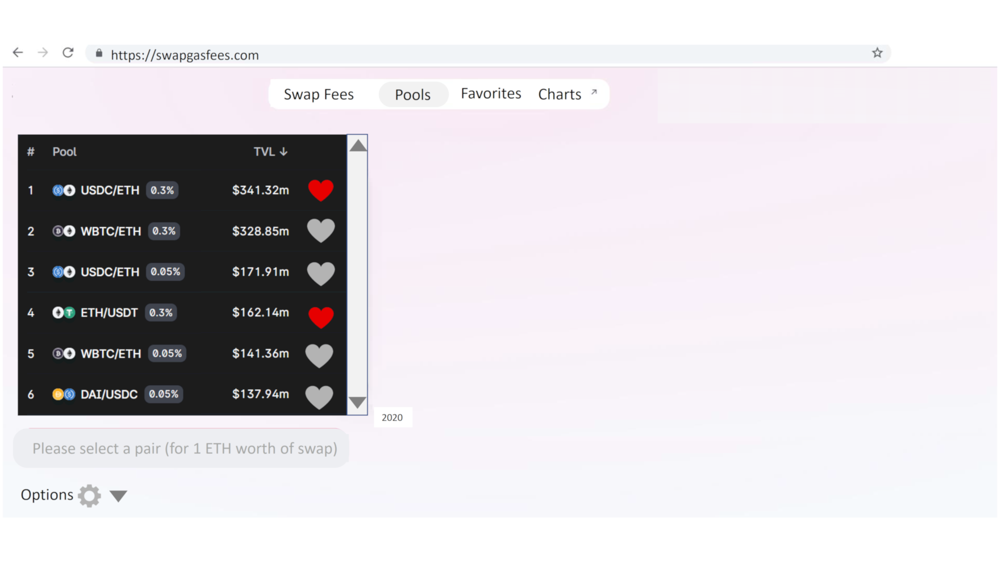
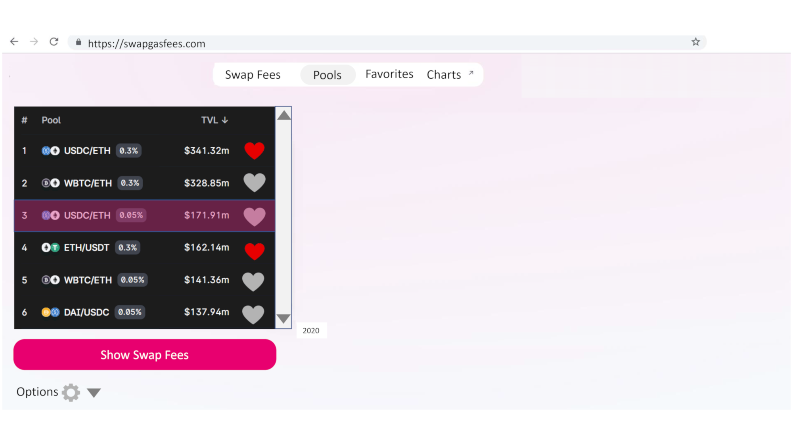
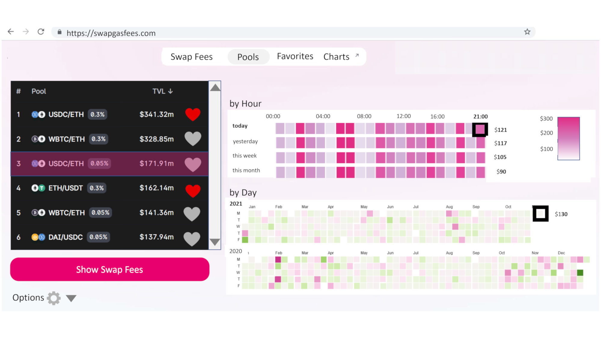
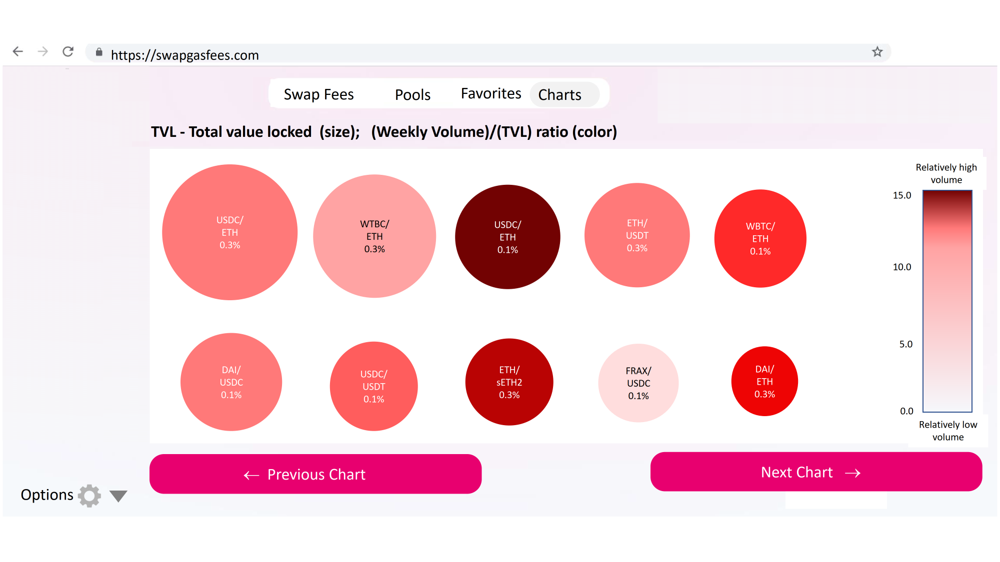
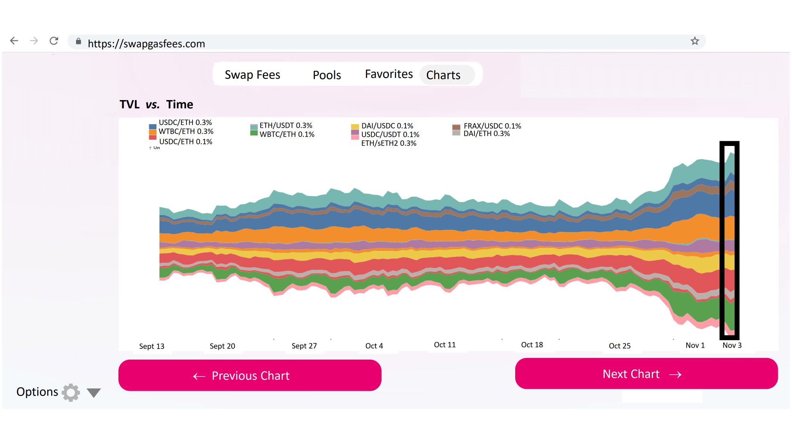
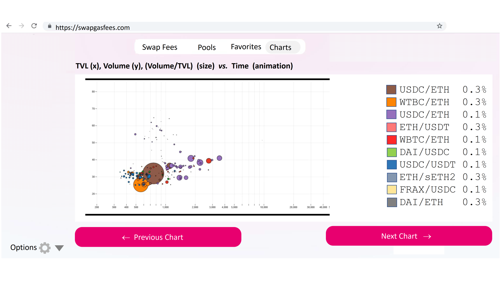
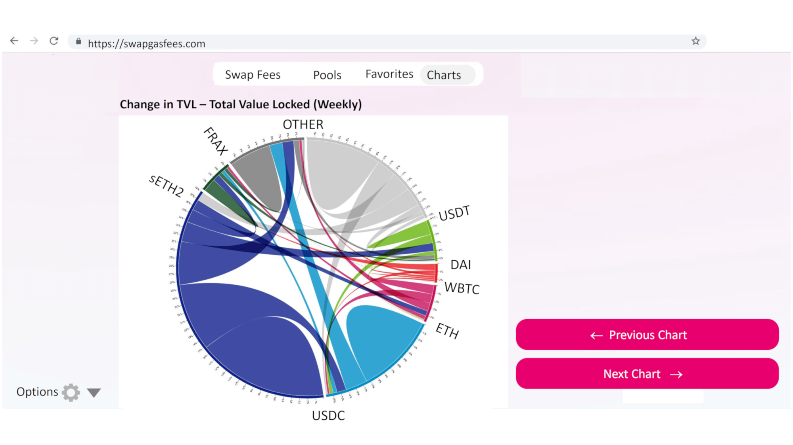

# SwapGasFees Tutorial

<hline>
</hline>

**[Gurdal Ertek](https://ertekprojects.com)**

_Member of [BlockBlockData](https://blockblockdata.com) Team; Associate Professor of Business Analytics, [UAE University](https://cbe.uaeu.ac.ae/en/departments/analytics/), Abu Dhabi, UAE_

<hline>
</hline>

## Abstract
  
This tutorial descibes the working of the proposed SwapGasFees app, **an analytics dashboard to** interactively and dynamically **display swap gas fees** (swap fees) on [Uniswap](https://uniswap.org). The dashboard also displays other charts that give analytical insights into the Uniswap ecosystem. 

The proposed SwapGasFees app is not implemented during the period of [UniCode Competition 2021](https://unicode.ethglobal.com/), due to lack of time and difficulties in finding team members. Yet, it outlines a blue print of how such a system can be implemented over an extended time period. In other words, the design provides a template, through which such a dashboard can be coded.

The following sections describe the working of the proposed app, through different screens.  

## **Slide 1:** Opening Screen, `Swap Fee` Tab, and Options

1. The first opening screen of the app is the `Swap Fee` Tab, with the tabs, swap pair selection on the left, and `Options` button at the left bottom. 
2. The simple design orients the user to the interface, avoiding any chance of overwhelming. 
The interface, as can easily be noticed by those familiar with [Uniswap](https://uniswap.com), directly mimics the Uniswap interface. This enables a mental resonance in the user's cognition, that this app is indeed related to Uniswap. 
3. While being similar to Uniswap interface, the SwapGasFees interface is even simpler, and does not require connecting to a wallet.
4. There are four tabs, namely, `Swap Fees`, `Pools`, `Favorites`, and `Charts`. 
5. Swap pair is selected on the left hand side from the drop-down menus, just as in Uniswap.
6. It is possible to add a pair as a favorite, through clicking the gray heart and turning it into red.
7. All favorite pairs are made available under the `Favorites` tab.
8. Until the swap amount is selected, the swap button is not activated.
9. The `Options` in the lower left corner can be seen through clicking the triangle. It will disappear when the triangle is pressed again.
10. `Options` are first day of the week, email address as input, and the selected color scheme.

## **Slide 2:** Selecting a Swap Pair and the Amount
Once the swap amount is specified, `Show Swap Fees` button appears, in the same magenta tone as the original Uniswap swap button.

## **Slide 3:** (Interface 1) Visualizing Swap Fees for the Selected Pair
1. After the `Show Swap Fees` button is clicked, the app extracts data from a database populated apriori, and displays two visualizations. 
2. The first visualization, on the upper right, is the swap gas fee for the selected fee, `by Hour` of the day. 
3. In the `by Hour` visualization, there are four rows, corresponding to the swap fees for `today`, `yesterday`, `this week`, and `this month`.
4. The black rectangle with the thick border shows the current time of the day.
5. The legend on the right hand side displays the fees with respect to the color scale.
6. The important text are shown in bold, including the text for `today`, current time, and fees for the current time and benchmark time points. 
7. The second visualization is on the lower right hand side, displaying swap gas fees `by Day`. 
8. The `by Day` visualization again displays the gas fees, but based on day of the year and month, enabling benchmark with previous months of the same year and the similar days of the past year.
9. In both visualizations, the unrealized future time periods are shown as blank (white color).
10. Using the two visualizations, a user can visually grasp whether now is a good time to swap or not.

## **Slide 4:** Selecting a Swap Pair from Top `Pools` from Under `Pools` Tab

## **Slide 5:** Selecting a Swap Pair with Default Amount of 1 ETH

## **Slide 6:** Visualizing Swap Fees for the Selected Top Pair

## **Slide 7: (Interface 2) ** Timeline Visualization under `Chart` Tab

## **Slide 8:** Bubble Chart Visualization 

## **Slide 9:** Arc Diagram Visualization 

## **Slide 10:** Animated Scatter 

## **Slide 11:** Chord Diagram 

## Author

<table>
  <tr>
    <td width=150px></td>
    <td><b>Gürdal Ertek</b> is an Associate Professor at UAE University (UAEU), Al Ain, UAE. He received his Ph.D. from Georgia Institute of Technology, Atlanta, GA, in 2001. Dr. Ertek served in educational and research organizations in Turkey, USA, Singapore, Kuwait and UAE, as well as an on-site reviewer for 50+ industrial R&D projects. His research and teaching areas include applied data science, business analytics, supply chain management, project management, and R&D management. His earlier hackathon in the Ethereum ecosystem was the <a href="**http://ertekprojects.com**" target="_blank">"Medalla Data Challenge,"</a> where Dr. Ertek was the only participant from academia, and <a href="https://blockblockdata.github.io/medalla-data-challenge/" target="_blank">joint work with teammate Joseph Kholodenko</a>, as <a href="https://blockblockdata.com" target="_blank">BlockBlockData Team</a>, was awarded with <a href="https://blog.ethereum.org/2020/11/17/medalla-data-challenge-results/" target="_blank">Bronze Medal</a>. Dr. Ertek's research and other work can be accessed through <a href="http://ertekprojects.com" target="_blank">ErtekProjects.com</a>  </td>
  </tr>
</table>
