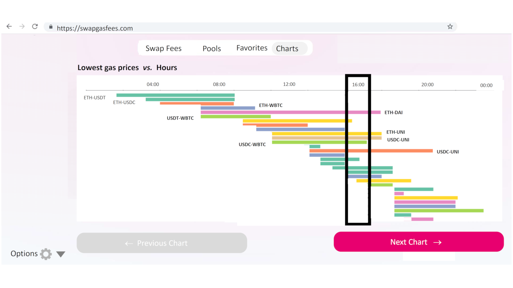

# SwapGasFees Tutorial

<hline>
</hline>

**[Gurdal Ertek](https://ertekprojects.com)**

_Member of [BlockBlockData](https://blockblockdata.com) Team; Associate Professor of Business Analytics, [UAE University](https://cbe.uaeu.ac.ae/en/departments/analytics/), Abu Dhabi, UAE_

<hline>
</hline>

## Abstract
  
This tutorial descibes the working of the proposed SwapGasFees app, **an analytics dashboard to** interactively and dynamically **display swap gas fees** (swap fees) on [Uniswap](https://uniswap.org). The dashboard also displays other charts that give analytical insights into the Uniswap ecosystem. 

The proposed SwapGasFees app is not implemented during the period of [UniCode Competition 2021](https://unicode.ethglobal.com/), due to lack of time and difficulties in finding team members. Yet, it outlines a blue print of how such a system can be implemented over an extended time period. In other words, the design provides a template, through which such a dashboard can be coded.

The following sections describe the working of the proposed app, through different screens.  

## Screen 1: Opening Screen, `Swap Fee` Tab, and Options
1. The first opening screen of the app is the `Swap Fee` Tab, with the tabs, swap pair selection on the left, and `Options` button at the left bottom. 
2. The simple design orients the user to the interface, avoiding any chance of overwhelming. 
The interface, as can easily be noticed by those familiar with [Uniswap](https://uniswap.com), directly mimics the Uniswap interface. This enables a mental resonance in the user's cognition, that this app is indeed related to Uniswap. 
3. While being similar to Uniswap interface, the SwapGasFees interface is even simpler, and does not require connecting to a wallet.
4. There are four tabs, namely, `Swap Fees`, `Pools`, `Favorites`, and `Charts`. 
5. Swap pair is selected on the left hand side from the drop-down menus, just as in Uniswap.
6. It is possible to add a pair as a favorite, through clicking the gray heart and turning it into red.
7. All favorite pairs are made available under the `Favorites` tab.
8. Until the swap amount is selected, the swap button is not activated.
9. The `Options` in the lower left corner can be seen through clicking the triangle. It will disappear when the triangle is pressed again.
10. `Options` are first day of the week, email address as input, and the selected color scheme.

## Screen 2: Selecting a Swap Pair and the Amount
Once the swap amount is specified, `Show Swap Fees` button appears, in the same magenta tone as the original Uniswap swap button.

## Screen 3: (Interface 1) Visualizing Swap Fees for the Selected Pair
1. After the `Show Swap Fees` button is clicked, the app extracts data from a database populated apriori, and displays two visualizations. 
2. The first visualization, on the upper right, is the swap gas fee for the selected fee, `by Hour` of the day. 
3. In the `by Hour` visualization, there are four rows, corresponding to the swap fees for `today`, `yesterday`, `this week`, and `this month`.
4. The black rectangle with the thick border shows the current time of the day.
5. The legend on the right hand side displays the fees with respect to the color scale.
6. The important text are shown in bold, including the text for `today`, current time, and fees for the current time and benchmark time points. 
7. The second visualization is on the lower right hand side, displaying swap gas fees `by Day`. 
8. The `by Day` visualization again displays the gas fees, but based on day of the year and month, enabling benchmark with previous months of the same year and the similar days of the past year.
9. In both visualizations, the unrealized future time periods are shown as blank (white color).
10. Using the two visualizations, a user can visually grasp whether now is a good time to swap or not.
11. Sample source code for implementing the first visualization can be found as [Timeline visualization](https://observablehq.com/@tezzutezzu/world-history-timeline). Sample source code for the second visualization can be found as [Calendar visualization](https://observablehq.com/@d3/calendars), both under the [ObservableHQ Gallery](https://observablehq.com/@d3/gallery). The JavaScript visualization library used is [D3.js](https://d3js.org).

## Screen 4: Selecting a Swap Pair from Top `Pools` from Under `Pools` Tab
1. The next available tab is the `Pools` tab. 
2. When the `Pools` tab is clicked, the top pools in Uniswap are displayed on the left hand side of the screen. 
3. As in the opening screen, this screen also begins very simple, making sure not to crowd the screen, unless a specific selection is made.
4. Top liquidity pools, in the same order as `Top pools` under Uniswap's `Pools`tab, and their pairs are displayed together with the total value locked (TVL).
5. From the list of pools, favorite pools can be added to the list of `Favorites` by clicking the gray heart next to it and turning it into red. The reverse action removes that pair from the list of `Favorites`.
6. It is worth noting that there is no action button active at the moment. Instead, there is a message that prompts `Please select a pair (for 1 ETH worth of swap)`. This makes it clear that the swap fees to be displayed will be for a swap with 1 ETH worth. In other words, there is no specification of amount here, to make the interface cognitively manageable.

## Screen 5: Selecting a Swap Pair with Default Amount of 1 ETH
When a specific pair is selected from the available list of top pools, that pool is highlighted with the Uniswap magenta, and the `Show Swap Fees` button finally appears.

## Screen 6: Visualizing Swap Fees for the Selected Top Pair
After the `Show Swap Fees` button is clicked, the app extracts data from a database populated apriori, and displays two the same two visualizations as in the `Swap Fees` tab. However, as mentioned earlier, the fees here will be for a swap worth 1 ETH.. 

## Screen 7: (Interface 2) Timeline Visualization under `Charts` Tab
1. The second main function of the SwapGasFees app is the display of various charts, under the `Charts` tab, to enable a deeper understanding of the Uniswap ecosystem.
2. The `Charts` tab implements a different interface than the earlier three tabs: There is a display (possibly with a legend) and two navigation buttons, namely `Previous Chart` and `Next Chart`. This interface design again is targeted to minimize the cognitive load on the user, allowing the user to digest the reported results one at a time.
3. The first screen has the `Previous Chart` button disabled, yet still in display, to provide a hint of what is to come.
4. The first screen of the `Charts` tab immediately provides the most important information, off the bat: _"What are the best times for swaps of top pairs?"_
5. The visualization shows time on the x axis and top pairs on the y axis (as rows). 
6. Each bar displays the favorable times for each swap pair. There has to be a consistent rule for all pairs, to identify the best times, such as _"Select the times where the price is at the lower 30% quartile"_.
7. While the presented visualization shows bars as a single color, each bar can potentially be drawn to allow a color spectrum.
8. Sample source code for implementing this visualization can be found as [Timeline visualization](https://observablehq.com/@tezzutezzu/world-history-timeline), under [ObservableHQ Gallery](https://observablehq.com/@d3/gallery). The JavaScript visualization library used is [D3.js](https://d3js.org).

## Screen 8: Bubble Chart  
1. The next visualization under the `Charts` tab is the bubble chart, which displays the total value locked (TVL) in top pools and the ratio of weekly volume to TVL.
2. Each circle represents a pool in the top pools list and the size of each circle denotes the total value locked (TVL) in that pool.
3. Color of each circle shows the ratio (Weekly Volume)/TVL. This is a measure of _"turnover"_ of the pool. Higher values (darker colors) suggest that the pool is actively used, whereas light colors suggest that the pool is not actively used.
4. The legend on the right had side maps the color scale to the actual swap values of the mentioned ratio.
5. Sample source code for implementing this visualization can be found as [Bubble chart](https://observablehq.com/@d3/bubble-chart), under [ObservableHQ Gallery](https://observablehq.com/@d3/gallery). The JavaScript visualization library used is [D3.js](https://d3js.org).

## Screen 9: Stacked Area Chart 
The next visualization under the `Charts` tab is the stacked area chart, which displays the total value locked (TVL) in top pools over time, as well as the total TVL for these pools. This chart is particularly beneficial to see thre trends in the liquidity for a particular pool or for Uniswap pools on the aggregate.

## Screen 10: Animated Scatter Plot
1. The next visualization is an animated scatter plot, where the changes in time are reflected in the time flow of the animation.
2. The animated scatter plot was developed and popularized by the legendary information visualization pioneer, [Hans Rosling](https://en.wikipedia.org/wiki/Hans_Rosling), especially through his [TED Talks](https://www.gapminder.org/videos/). 
3. Implemented firstly in the [Trendalyzer software](https://en.wikipedia.org/wiki/Trendalyzer) by the GapMinder Foundation, animated scatter plot has become a popular tool for displaying changes of discrete entities over time, with respect to four or more dimensions (plus time).
4. The four dimensions of an attribute are reflected on the x axis, y axis, size of the circles (glyphs), and the color of the circles. Time is the fifth dimension.
5. In the design developed specifically for Uniswap, each swap pair is an entity, represented as a circle. 
6. x axis denotes the TVL and the y axis denotes volume. 
7. The Volume/TVL ratio, which is a measure of the _"turnover"_ of the pair on Uniswap, is chosen to be denoted by the size of the circle. Low values of this ratio can identify pairs that have too much liquidity compared to volume.
8. Finally, color is used to denote the particular swap pair. (The visualization presented below is only representative, but not exactly reflective).
9. When the scatter plot is animated over time, the circles move, expand and contract, shift regions as groups on the two-dimensional plane, and do many other fascinating things.

## Screen 11: Chord Diagram 

## Author

<table>
  <tr>
    <td width=150px></td>
    <td><b>Gürdal Ertek</b> is an Associate Professor at UAE University (UAEU), Al Ain, UAE. He received his Ph.D. from Georgia Institute of Technology, Atlanta, GA, in 2001. Dr. Ertek served in educational and research organizations in Turkey, USA, Singapore, Kuwait and UAE, as well as an on-site reviewer for 50+ industrial R&D projects. His research and teaching areas include applied data science, business analytics, supply chain management, project management, and R&D management. His earlier hackathon in the Ethereum ecosystem was the <a href="https://ethereum.org/en/eth2/get-involved/medalla-data-challenge/" target="_blank">"Medalla Data Challenge,"</a> where Dr. Ertek was the only participant from academia. <a href="https://blockblockdata.github.io/medalla-data-challenge/" target="_blank">Joint work</a> of teammate <a href="https://www.linkedin.com/in/josephkholodenko/" target="_blank">Joseph Kholodenko</a> and <a href="https://ertekprojects.com/about-dr-gurdal-ertek/" target="_blank">Gurdal Ertek</a>, as <a href="https://blockblockdata.com" target="_blank">BlockBlockData Team</a>, was awarded with <a href="https://blog.ethereum.org/2020/11/17/medalla-data-challenge-results/" target="_blank">Bronze Medal</a>. Dr. Ertek's research and other work can be accessed through <a href="http://ertekprojects.com" target="_blank">ErtekProjects.com</a>  </td>
  </tr>
</table>
