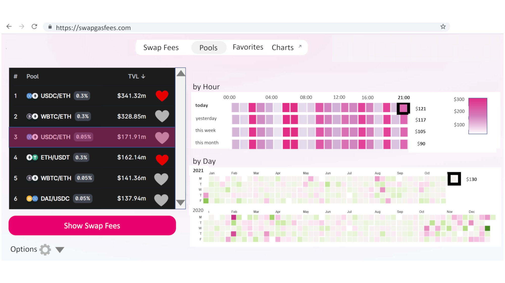

## Screen 6: Visualizing Swap Fees for the Selected Top Pair
After the `Show Swap Fees` button is clicked, the app extracts data from a database populated apriori, and displays two the same two visualizations as in the `Swap Fees` tab. However, as mentioned earlier, the fees here will be for a swap worth 1 ETH.. 

[Screen 1](Screen01.md) | [Screen 2](Screen02.md) | [Screen 3](Screen03.md) | [Screen 4](Screen04.md) | **[Screen 5](Screen05.md) | Screen 6 | [Screen 7](Screen07.md)** | [Screen 8](Screen08.md) | [Screen 9](Screen09.md) | [Screen 10](Screen10.md) | [Screen 11](Screen11.md) 

[Main Article](../README.md) | [Complete Tutorial](../Tutorial.md) 
