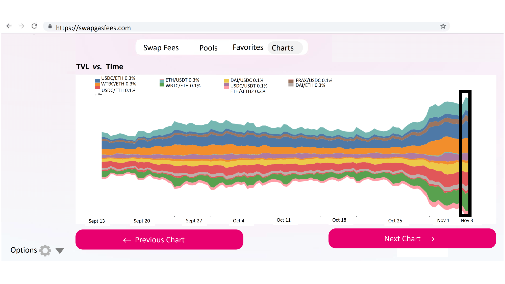

## Screen 9: Stacked Area Chart 
1. The next visualization under the `Charts` tab is the stacked area chart, which displays the total value locked (TVL) in top pools over time, as well as the total TVL for these pools. 
2. This chart is particularly beneficial to see thre trends in the liquidity for a particular pool or for Uniswap pools on the aggregate.
3. Sample source code for implementing this visualization can be found as ["Stacked Area chart - Streamgraph"](https://observablehq.com/@d3/streamgraph).

[Screen 1](Screen01.md) | [Screen 2](Screen02.md) | [Screen 3](Screen03.md) | [Screen 4](Screen04.md) | [Screen 5](Screen05.md) | [Screen 6](Screen06.md) | [Screen 7](Screen07.md) | **[Screen 8](Screen08.md) | Screen 9 | [Screen 10](Screen10.md)** | [Screen 11](Screen11.md) 

[Main Article](../README.md) | [Complete Tutorial](../Tutorial.md) 
